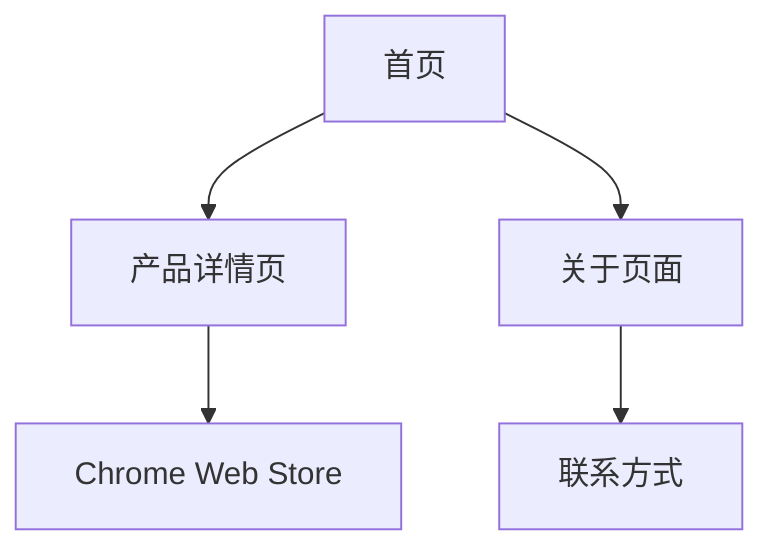

## 1. Product Overview

kmindlab个人主页是一个静态网站，用于展示kmindlab开发的软件产品。网站采用Jekyll框架开发，支持GitHub Pages部署，主要展示chrome标签管理插件等软件产品，为用户提供产品信息和下载入口。

* 解决问题：为kmindlab提供专业的产品展示平台，让用户了解和获取软件产品

* 目标用户：潜在用户、现有用户、合作伙伴

* 产品价值：建立品牌形象，提升产品知名度，促进用户转化

## 2. Core Features

### 2.1 User Roles

本项目为静态展示网站，无需用户注册和角色区分，所有访问者均为匿名用户。

### 2.2 Feature Module

我们的个人主页包含以下主要页面：

1. **首页**：品牌介绍、产品概览、导航菜单
2. **产品详情页**：chrome标签管理插件详细介绍、功能展示、下载链接
3. **关于页面**：个人/团队介绍、开发理念、联系方式

### 2.3 Page Details

| Page Name | Module Name | Feature description          |
| --------- | ----------- | ---------------------------- |
| 首页        | 头部导航        | 包含logo、主导航菜单，响应式设计适配移动端      |
| 首页        | 品牌介绍区       | 展示kmindlab品牌信息、开发理念、核心价值     |
| 首页        | 产品概览区       | 卡片式布局展示主要产品，支持未来产品扩展         |
| 首页        | 页脚          | 联系方式、社交媒体链接、版权信息             |
| 产品详情页     | 产品标题区       | 显示产品名称、简介、Chrome Web Store链接 |
| 产品详情页     | 功能展示区       | 详细介绍自动分组、自动排序、自定义规则等核心功能     |
| 产品详情页     | 截图展示区       | 产品界面截图、使用演示                  |
| 产品详情页     | 下载安装区       | Chrome Web Store下载按钮、安装指南    |
| 关于页面      | 个人介绍区       | 开发者/团队介绍、技术背景、开发经历           |
| 关于页面      | 联系方式区       | 邮箱、GitHub、反馈表单               |

## 3. Core Process

用户访问流程：

1. 用户访问首页，浏览品牌介绍和产品概览
2. 点击感兴趣的产品卡片，进入产品详情页
3. 在产品详情页了解功能特性，点击下载链接安装产品
4. 通过关于页面了解开发团队，获取联系方式

## 4. User Interface Design

### 4.1 Design Style

* 主色调：深蓝色(#2563eb)，辅助色：浅灰色(#f8fafc)

* 按钮样式：圆角按钮，悬停效果，渐变背景

* 字体：系统字体栈，标题18-24px，正文14-16px

* 布局风格：卡片式设计，顶部导航，网格布局

* 图标风格：简洁线性图标，统一风格

### 4.2 Page Design Overview

| Page Name | Module Name | UI Elements            |
| --------- | ----------- | ---------------------- |
| 首页        | 头部导航        | 白色背景，深色文字，悬停效果，移动端汉堡菜单 |
| 首页        | 品牌介绍区       | 居中布局，大标题，副标题，简洁描述文字    |
| 首页        | 产品概览区       | 网格布局，产品卡片，阴影效果，悬停动画    |
| 产品详情页     | 功能展示区       | 左右交替布局，图文结合，特性列表       |
| 关于页面      | 联系方式区       | 表单样式，输入框，提交按钮，社交图标     |

### 4.3 Responsiveness

采用移动优先的响应式设计，断点设置：

* 移动端：< 768px

* 平板端：768px - 1024px

* 桌面端：> 1024px
  支持触摸交互优化，适配不同屏幕尺寸

