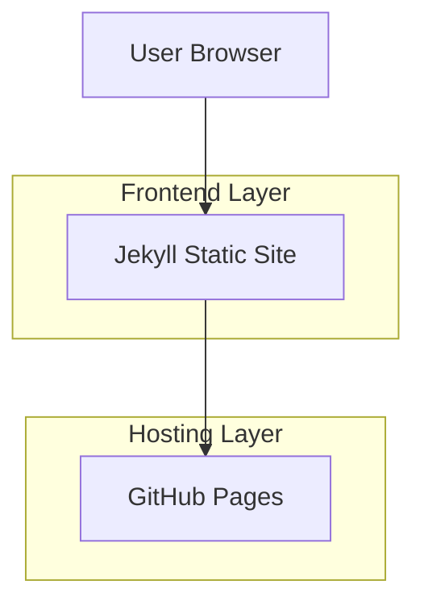
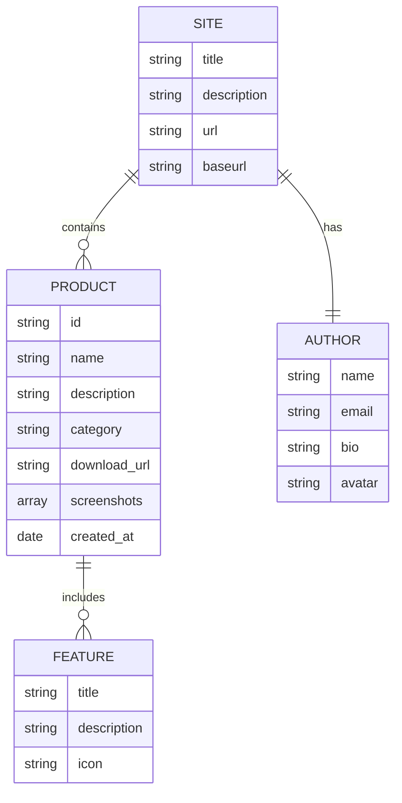

## 1.Architecture design



## 2.Technology Description

* Frontend: Jekyll\@4.3 + Liquid Templates + Sass + JavaScript ES6

* Styling: Tailwind CSS\@3.4 + Custom CSS

* Build Tool: Jekyll Build System

* Hosting: GitHub Pages

* Version Control: Git + GitHub

## 3.Route definitions

| Route                       | Purpose           |
| --------------------------- | ----------------- |
| /                           | 首页，展示品牌介绍和产品概览    |
| /products/smart-tab-manager | Chrome标签管理插件详情页   |
| /about                      | 关于页面，个人介绍和联系方式    |
| /assets/\*                  | 静态资源文件（CSS、JS、图片） |

## 4.API definitions

本项目为纯静态网站，无需后端API。所有数据通过Jekyll的数据文件（YAML/JSON）和Markdown文件管理。

## 5.Data model

### 5.1 Data model definition



### 5.2 Data Definition Language

由于Jekyll使用文件系统作为数据存储，以下为主要数据文件结构：

**网站配置文件 (\_config.yml)**

```yaml
# Site settings
title: kmindlab
description: 专注开发实用软件工具
baseurl: ""
url: "https://kmindlab.github.io"

# Author settings
author:
  name: "kmindlab"
  email: "contact@kmindlab.com"
  bio: "致力于开发提升用户体验的软件工具"
  avatar: "/assets/images/avatar.jpg"

# Build settings
markdown: kramdown
highlighter: rouge
theme: minima
plugins:
  - jekyll-feed
  - jekyll-sitemap
  - jekyll-seo-tag

# Collections
collections:
  products:
    output: true
    permalink: /products/:name/
```

**产品数据文件 (\_data/products.yml)**

```yaml
- id: smart-tab-manager
  name: "智能标签管理"
  description: "全自动标签页整理工具"
  category: "Chrome扩展"
  download_url: "https://chromewebstore.google.com/detail/smart-tab-manager/pgcammgkgbpbdchcfocijooacojecdbi"
  icon: "/assets/images/smart-tab-manager-icon.png"
  screenshots:
    - "/assets/images/smart-tab-manager-1.png"
    - "/assets/images/smart-tab-manager-2.png"
  features:
    - title: "自动分组"
      description: "自动检测域名并根据自定义规则将标签页自动分组"
      icon: "🔄"
    - title: "自动排序"
      description: "按你定义规则将标签分组进行排序，保持你的使用习惯"
      icon: "📋"
    - title: "自定义规则"
      description: "支持URL模式、关键词和正则匹配等自定义规则"
      icon: "⚙️"
    - title: "
```

